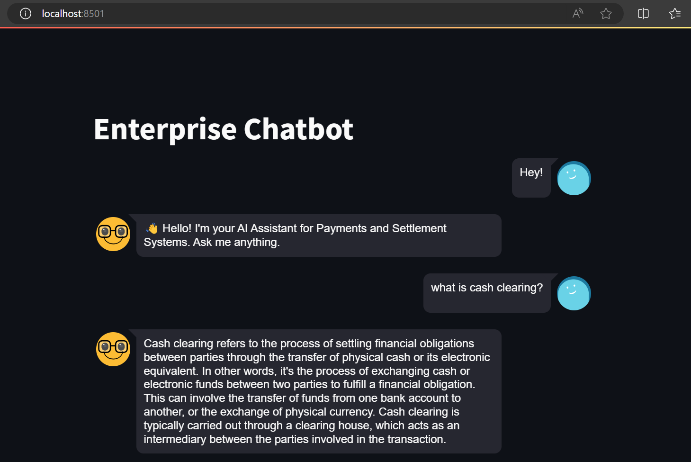
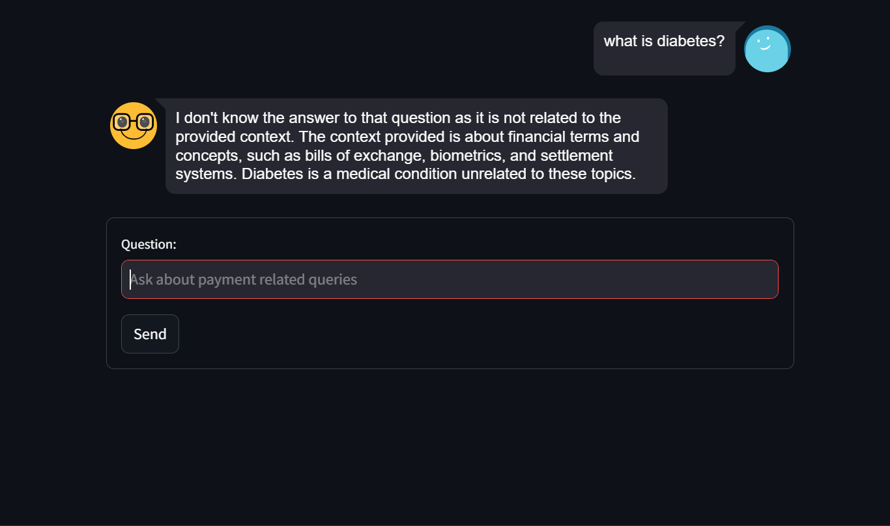

# Enterprise Chatbot for Payments and Settlement Systems

Welcome to the Enterprise Chatbot project designed to provide information and answer queries related to Payments and Settlement Systems.

## Features

- **Conversational Interface**: Engage in conversations about payment and settlement systems.
- **Intelligent Responses**: Uses advanced language models for accurate and informative answers.
- **Interactive History**: Keeps track of conversation history and generated responses.


# Project Overview
This project implements an Enterprise Chatbot focused on Payments and Settlement Systems using Streamlit for the user interface. The chatbot leverages advanced Natural Language Processing (NLP) techniques provided by LangChain. Here's a summary of the key components used:

**Embeddings Model**: HuggingFace's sentence-transformers/all-MiniLM-L6-v2 model is used for generating sentence embeddings.

**Retrieval Model**: FAISS is employed as the vector store for retrieving relevant documents based on similarity metrics.

**LLM (Large Language Model)**: The chatbot utilizes the llama-2-7b-chat.ggmlv3.q4_0.bin model from LangSmith for conversational responses.

## Installation

To run this application locally, follow these steps:

1. Clone the repository:
   ```bash
   git clone https://github.com/rohit180497/Enterprise-RAG-Chatbot
   cd Enterprise-RAG-Chatbot
   ```
2. Install dependencies:
    ```bash
    pip install -r requirements.txt
    ```
3. Run the Streamlit App:
    ```bash
    streamlit run app.py
    ```
4. Open your web browser and navigate to http://localhost:8501 to use the chatbot.

## Technology Stack
**Streamlit**: UI framework for interactive web applications.
**LangChain**: Framework for building and deploying language-based AI systems.
**HuggingFace Transformers**: Provides state-of-the-art pre-trained models for natural language understanding.

## Snapshots





